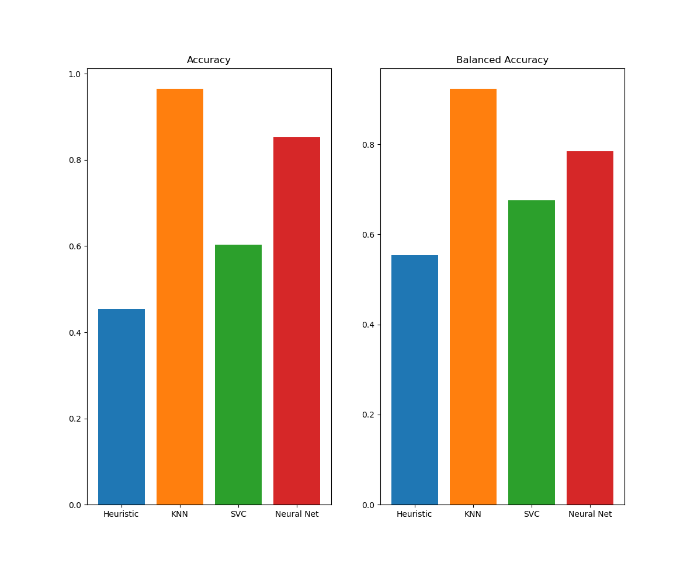
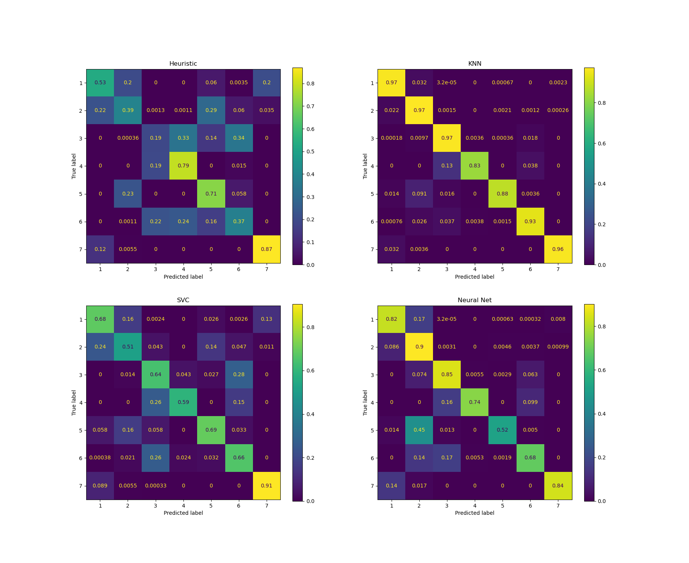

# Internship Task For Openx

This repository contains code for my internship task for OpenX. 

## API Documentation

### How to run the Docker image

1. Clone the repository
2. Run `docker build -t app .` to build the image
3. Run `docker run -p 8000:8000 app` to run the image 

At that stage, you should be able to access the API at `0.0.0.0:8000`.

### How to access the API

You can access the auto-generated API documentation at `0.0.0.0:8000/docs`.

Should this not be enough, here's a quick overview of the API:

* There are 4 endpoints, one for each model (similiarly to how HuggingFace does it with `InferenceAPI`): 
    1. `/api/heuristic`, being a very simple heuristic model,
    2. `/api/svc`, being a support vector classifier,
    3. `/api/knn`, being a k-nearest neighbors classifier, and
    4. `/api/neural_net` being a neural network classifier.
* Each endpoint takes a POST request with only one parameter: `data`, being a 54-element int array, representing features of the covtype dataset.
* While these are POST requests, they are not mutating the state of the server in any way. I've chosen the POST method, because we somehow need to pass the data to the server, and GET requests are not supposed to do that.
* Each endpoint returns a JSON object with a single key, `result`, whose value is the predicted class from the covtype dataset.

## Subtask completion

### 1. Loading the data

I've created a few functions to load the data from the CSV file. They can be found in the `load_data.py` file. Their semantics should be pretty self-explanatory; as requested, no feature engineering was done. 

Main function in the file provides example on how to use one of these functions.

### 2. Very simple heuristic

I performed some analysis on the data, and found that different cover types have different distributions of the `Elevation` feature. Thus, I've calculated the median elevation for each cover type. The heuristic checks for the elevation of the input data, and returns the cover type with the closest median elevation.

This could be further improved with eliminating certain cover types that are impossible, given a certain wilderness area they belong to. This would, however, make the heuristic more complex, and I've decided to keep it simple.

The heuristic can be found in the `heuristic.py` file. It is represented by the `HeursiticModel` class, with a simple `predict` method (to provide a consistent interface with the other models that will be used in the API).

### 3. Scikit-learn models

In the `scikit_models.py` file, I've created functions to train a SVC and a KNN model. Main function in the file simply trains these models (without saving them).

#### KNN

Very simple KNN model using the ball tree algorithm.

#### SVC

Support Vector Classifier with a rbf kernel. I've also tried other kernels, but their performance seemed to be worse. The number of training examples for the SVC is reduced to 5000 by default, as it takes quite some time to train the model otherwise. This behaviour can be changed by passing a different value to the `n_samples` parameter.

### 4. Neural network

Main function of the file `train_neural_net.py` tries to find optimal hyperparameters for a multilayer perceptron with a dropout layer, then trains the model with best hyperparameters. The model is then saved to the `models` directory. After training, the training curves are plotted for the user to see.

#### Hyperparameter search

I've used the `keras-tuner` library and `Hyperband` algorithm to perform the following hyperparameter search:

* number of hidden layers in the network (1 - 3)
* number of neurons in each hidden layer (64 - 512)
* whether to use a dropout layer (True, False)
* dropout rate (0.1 - 0.5)
* learning rate (0.0001 - 0.01)

The loss used is sparse categorical crossentropy, the optimizer is Adam and the activation function on the last layer is softmax. Activation functions on other layers are ReLU functions. Due to limited resources, I didn't include those in the hyperparameter search.

Because of the unbalanced nature of the dataset, I've used the `get_class_weights` function from `load_data.py` to calculate the class weights for the model to train with.

#### NeuralNetModel class

To provide a consistent interface with the other models, I've created a `NeuralNetModel` class, which wraps around a tensorflow model and has 2 methods: `predict` and `save`. The `predict` method takes a single parameter, `data`, being a (batch_size, 54) array of features and returns a (batch_size,) array of predictions. The `save` method saves the tensorflow model to a given directory. 

Furthermore, in the `train_neural_net.py` is a `get_model_from_directory` function, which loads a tensorflow model from a given directory and wraps it in a `NeuralNetModel` object.

### 5. Result evaluation

The `evaluate_models.py` loads the data, splits it into train, test and validation sets, trains all the models and evaluates them on the common test set. It then creates 2 plots:

* a plot of the accuracy and balanced accuracy for each model on the test set

* a plot of the confusion matrix for each model on the test set

### 6. API

The API was created with the FastAPI framework.

The `main.py` file provides an entry point for the uvicorn server. It first loads all the models, assuming the neural net model is saved in the `models/neural_net_model` directory. Because the model's size is quite small, I've decided to include it in the repository, so there are no additional steps required to run it. 

Please note that the `main.py` file trains the SVC and KNN models from scratch (which doesn't take long), but there is need to download the `covtype.data` file from the UCI repository. This is done automatically by the Dockerfile. If you need to run the API without Docker, you need to download the file manually, unpack it and name it `covtype.data`.

### 7. Dockerfile

The Dockerfile is meant to serve the API under the assumption that the neural net model is already trained. After building, please make sure to run the image with the `-p 8000:8000` flag, so that the API is accessible from the host machine.

## Final thoughts

I would like to thank you for the opportunity to work on this task and thank you for your time spent reading this document. It was a lot of fun to work on this task, and I hope you'll find my solution satisfactory. I'm looking forward to hearing from you.